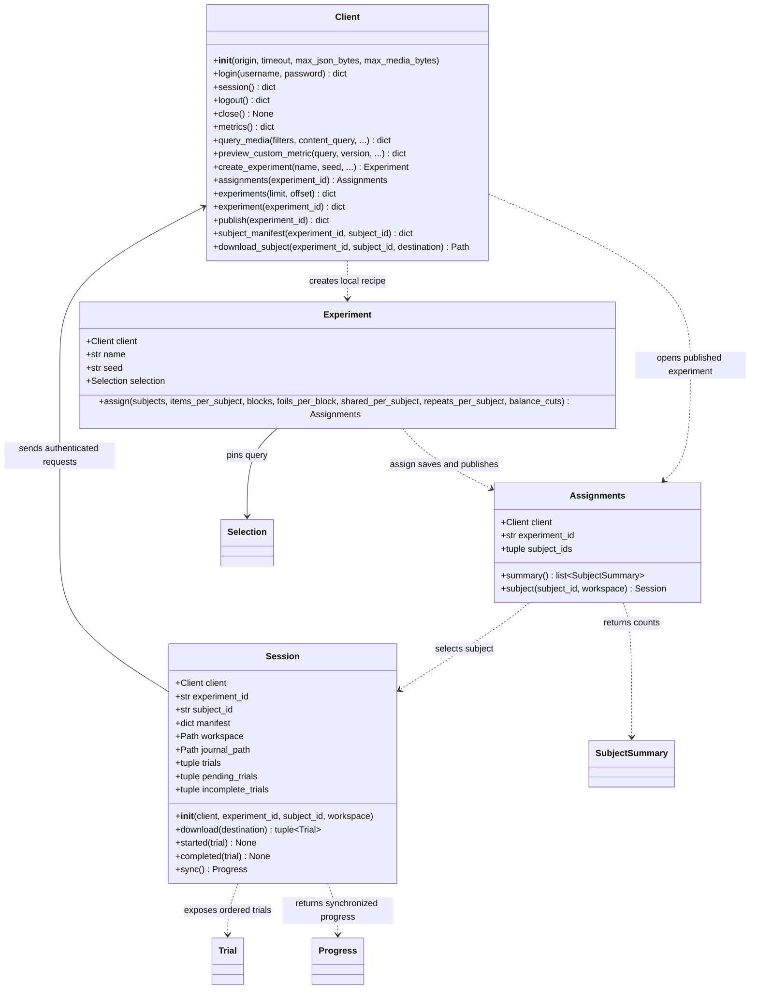
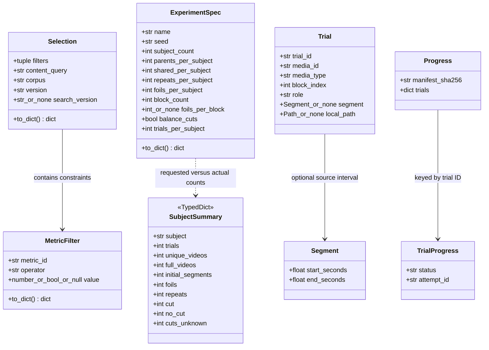
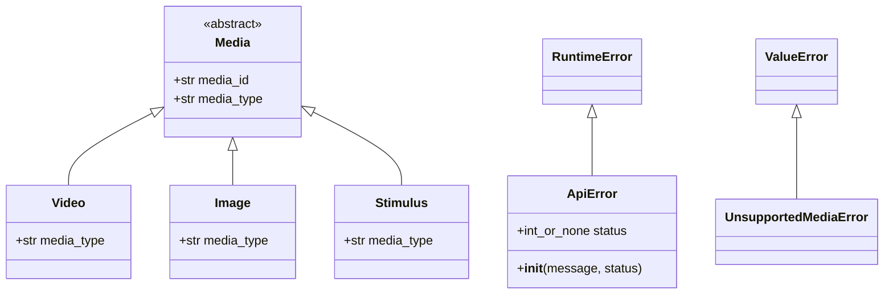

# Python API: classes and methods

This maps the **public Python client**, not the server's internal classes.
Method arguments are abbreviated in the diagrams. Data-class constructors accept
the listed fields; generated methods and private helpers are omitted.
Members without parentheses are fields or properties, not method calls.

## 1. Experiment workflow



### What each workflow object means

| Object | Meaning |
|---|---|
| `Client` | Authenticated connection to one website. Cookies stay in memory; instances are not thread-safe. |
| `Experiment` | A local recipe: name, seed, filters, and dataset version. Not yet saved assignments. |
| `Assignments` | A handle to a published experiment and its fixed subject roster on the server. |
| `Session` | One subject's manifest, local downloads, and local progress journal. Never plays media. |

### Client methods

| Method | Action |
|---|---|
| `Client(origin, ...)` | Configure the server URL, timeouts, and response-size limits. Does not log in. |
| `login(username, password)` | Authenticate and keep the session cookie and CSRF token in memory. |
| `session()` | Read the current website login session—not an experimental subject session. |
| `logout()` | Revoke the server login session and clear local credentials. |
| `close()` | Clear local credentials only. Context-manager exit also calls this. |
| `metrics()` | Read the metric inventory and supported operations. |
| `query_media(...)` | Fetch matching video rows, counts, and distributions. Supports content search, metric predicates, pagination, and saved-study scopes. |
| `preview_custom_metric(...)` | Preview a text-query-derived metric. Does not launch video-model processing. |
| `create_experiment(...)` | Query the dataset to pin its version, then return a local `Experiment` recipe. |
| `assignments(id)` | Open an already-published experiment without resampling. |
| `experiments(...)` | List accessible active experiments with pagination. |
| `experiment(id)` | Read one experiment's saved details and publication, if published. |
| `publish(id)` | Publish saved assignments. Useful for retrying publication after a failed `assign()` call. |
| `subject_manifest(id, subject_id)` | Retrieve and validate one subject's fixed trial manifest and its hash. |
| `download_subject(id, subject_id, destination)` | Lower-level download: validate the manifest and each media checksum, then return the local `manifest.json` path. |

### Experiment, Assignments, and Session methods

| Method or property | Action |
|---|---|
| `Experiment.assign(...)` | Save subject assignments and publish them. Each call creates a new record, even with the same seed. |
| `Assignments.summary()` | Read per-subject counts from the publication. Missing cut measurements remain unknown. |
| `Assignments.subject(id, workspace=...)` | Fetch the subject manifest and open its local journal; does not download videos yet. |
| `Session.trials` | Ordered `Trial` objects, with local paths when registered in this workspace. |
| `Session.download(destination)` | Download into a new folder, register verified local files in the journal, and return trials. Parent folders are created automatically. |
| `Session.started(trial)` | Check the downloaded file, check existing progress, journal a start, and synchronize. Stop if this fails. |
| `Session.completed(trial)` | Journal and synchronize successful completion for a locally started trial. Does not verify playback itself. |
| `Session.sync()` | Upload unacknowledged events and retrieve server-confirmed progress. |
| `Session.pending_trials` | Synchronize and return trials never started—not interrupted trials. |
| `Session.incomplete_trials` | Synchronize and return started-but-unfinished trials for review. |

Progress calls can perform network I/O. Keep synchronization outside timing-critical
rendering code. The presentation framework owns timing, playback, and behavioral results.

## 2. Configuration, trials, and progress



- `MetricFilter`: one predicate, such as duration ≥ 10. `to_dict()` serializes it.
- `Selection`: the query and pinned dataset/search versions. `to_dict()` returns request fields.
- `ExperimentSpec`: validated allocation counts. `trials_per_subject` is parents + repeats + foils; `to_dict()` serializes settings. `Experiment.assign()` constructs this for you.
- `Trial`: one presentation, not necessarily one unique video. Roles are `parent`, `repeat`, and `foil`.
- `Segment`: the source interval for a trimmed trial. First-half parents and second-half foils both use it. Downloaded files are already trimmed.
- `Progress`: server-confirmed status for this manifest, indexed by trial ID.
- `TrialProgress`: `started` or `completed`, plus the attempt ID.
- `SubjectSummary`: a plain typed dictionary, not an object with behavior. Counts refer to presentations except `unique_videos`.

`Trial`, `Segment`, `Progress`, and `TrialProgress` are data classes with no custom
public methods. They carry values for your task code.

## 3. Media types and errors



- `Media` is an abstract descriptor. Subclasses expose `media_type` as a property.
- `Video` is supported end to end. `Image` and `Stimulus` are future descriptors only.
- `media_from_row(row)` is a standalone function: convert a query row or manifest trial into one of these descriptors. It does not download or play anything.
- `ApiError` reports request/manifest/download failures, with an optional HTTP status.
- `UnsupportedMediaError` rejects unsupported media operations or unknown media types.

## Minimal usage

```python
experiment = client.create_experiment(name="Demo", seed="demo-1", filters=[])
assignments = experiment.assign(subjects=5, items_per_subject=20,
                                foils_per_block=4, balance_cuts=True)
print(assignments.summary())
session = assignments.subject("subject-001")
trials = session.download("new-subject-folder")
```

For later runs, replace the first two lines with
`assignments = client.assignments(saved_experiment_id)` to avoid creating a new experiment.
The cut-balanced example requires the configured complementary-half server and measured candidate pool.

Source: `src/dbp_api/client.py`, `src/dbp_api/workflow.py`, and `src/dbp_api/models.py`.
See [server-to-local flow](server-to-local-flow.md) for the storage and HTTP boundaries.
