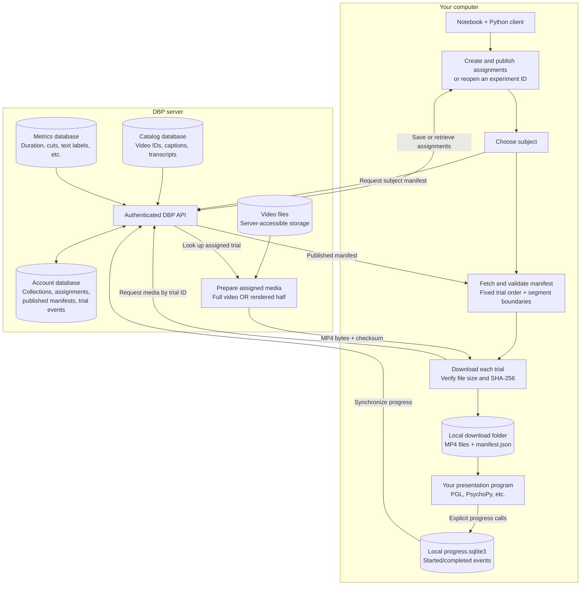

# Server-to-local video flow

The databases store metadata and assignments; videos are separate files.

- Reopening an experiment ID does not resample.
- Halves are rendered server-side; downloaded files are ready to present.
- Downloads do not record presentations. The task must report progress explicitly.
- The notebook uses the authenticated HTTP API, not a direct database connection.
